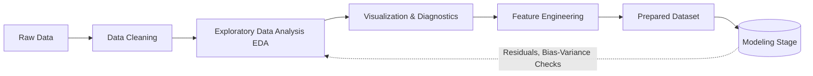

# Data Analysis – Foundation Before Machine Learning

This repository is a hands-on learning space focused on building **robust and reproducible** data analysis workflows across **diverse real-world datasets** — *before* applying any machine learning or complex modeling techniques.  

> **Core Principle:** You can't trust machine learning unless you understand and trust your data first.

---

## Repository Structure

| Folder                  | Description                                                                 |
|-------------------------|-----------------------------------------------------------------------------|
| `financial`          | Data cleaning and exploratory analysis of structured financial datasets (house prices, macroeconomic indicators). |
| `bioinformatics`     | Preprocessing and exploratory workflows for bioinformatics datasets (breast cancer, gene expression, genetic variation). |
| `general`            | Universal EDA techniques on classic datasets (Iris, weather, surveys, transport, healthcare indicators). |
| `visualizations`     | Reusable plotting utilities: histograms, correlation heatmaps, residual plots, time-series charts. |
| `feature-engineering`| Feature transformations, normalization, scaling, and one-hot encoding examples. |
| `end-to-end`         | Complete analysis pipelines integrating cleaning, EDA, visualization, and feature engineering. |

---

## Skills Showcased

- Data Cleaning (missing values, duplicates, outliers, type corrections)  
- Exploratory Data Analysis (EDA) and storytelling with data  
- Feature Engineering (scaling, normalization, categorical encoding)  
- Statistical Robustness and Reproducibility  
- Visualization with `matplotlib`, `seaborn`, and `plotly`  
- Applying **domain knowledge** to financial and bioinformatics data  

---

## Data Domains Covered

### Bioinformatics Data

- **Datasets**: Breast Cancer, gene expression matrices, genetic variations, alignments  
- **Focus**: Domain-specific preprocessing  
  - Normalization  
  - Filtering low-expression genes  
  - Reducing biological noise  

### Financial Data

- **Datasets**: House Prices, macroeconomic indicators  
- **Focus**:  
  - Handling missing or irregular time series data  
  - Identifying seasonality and trends  
  - Smoothing noisy signals  

### General-purpose Data

- **Datasets**: Iris dataset, surveys, weather, transport, health indicators  
- **Focus**:  
  - Universal EDA workflows  
  - Correlation and feature importance analysis  
  - Pattern discovery and anomaly detection  

---

## Lessons & Considerations

1. **Clean Data Makes a Difference**  
   Messy data leads to weak or misleading models.  
   - Fix missing values, duplicates, wrong types, and outliers early.  

2. **Data Tells a Story**  
   Before modeling, ask:  
   - What trends exist?  
   - Are there anomalies?  
   - Which features actually matter?  

3. **Domain-Specific Trust**  
   - Finance and bioinformatics demand transparency, reproducibility, and statistical rigor.  
   - Residual plots and error analysis reveal whether models capture relationships well.  

4. **Bias-Variance Trade-off**  
   - High Bias = model too simple → add features, increase complexity  
   - High Variance = model too complex or data leakage → use regularization, cross-validation, add more data  
   - Residual plots help spot both: random scatter = good fit  

---

## Core Skills

| Area                    | Tools/Skills                                  |
|-------------------------|-----------------------------------------------|
| Data Cleaning           | `pandas`, `numpy`, missing value handling     |
| Exploratory Data Analysis (EDA) | Histograms, correlation heatmaps, group analysis |
| Feature Engineering     | Transformations, scaling, one-hot encoding    |
| Domain Knowledge Mapping| Applying context to patterns in data          |
| Visualization           | `matplotlib`, `seaborn`, `plotly`             |

---

## Workflow Diagram

This diagram shows the **iterative nature** of data analysis:

- Data moves forward through cleaning, EDA, visualization, and feature engineering.
- Feedback loops (residuals, diagnostics) guide refinements before reaching the modeling stage.

---

## Optimizations & Best Practices

1. **Bias-Variance Trade-off**  
   - **High Bias**: Try more complex models or add relevant features  
   - **High Variance**: Apply regularization, cross-validation, or collect more data  
   - Always watch for **data leakage** ([reference](https://airbyte.com/data-engineering-resources/what-is-data-leakage))  

2. **Reproducibility**  
   - Keep analysis workflows scripted (not just ad hoc exploration)  
   - Use consistent preprocessing pipelines  

3. **Visualization as Diagnostics**  
   - Residual plots to assess model fit  
   - Correlation heatmaps to detect multicollinearity  
   - Time-series plots to reveal seasonality or anomalies  

---

## Resources

### Python & Data Analysis

- [pandas Documentation](https://pandas.pydata.org/docs/)  
- [NumPy Documentation](https://numpy.org/doc/)  
- [scikit-learn Datasets](https://scikit-learn.org/stable/datasets/toy_dataset.html)  

### Visualization

- [Matplotlib Documentation](https://matplotlib.org/stable/contents.html)  
- [Seaborn Documentation](https://seaborn.pydata.org/)  
- [Plotly for Python](https://plotly.com/python/)  

### Domain-Specific

- [Bioinformatics Data Handling (NCBI)](https://www.ncbi.nlm.nih.gov/)  
- [Financial Data Analysis with Python](https://pandas.pydata.org/pandas-docs/stable/user_guide/timeseries.html)  

### Best Practices

- [Cross-validation in scikit-learn](https://scikit-learn.org/stable/modules/cross_validation.html)  
- [Bias-Variance Trade-off (Hands-On ML Book)](https://www.oreilly.com/library/view/hands-on-machine-learning/9781492032632/)  
- [Data Leakage Explained](https://airbyte.com/data-engineering-resources/what-is-data-leakage)  
